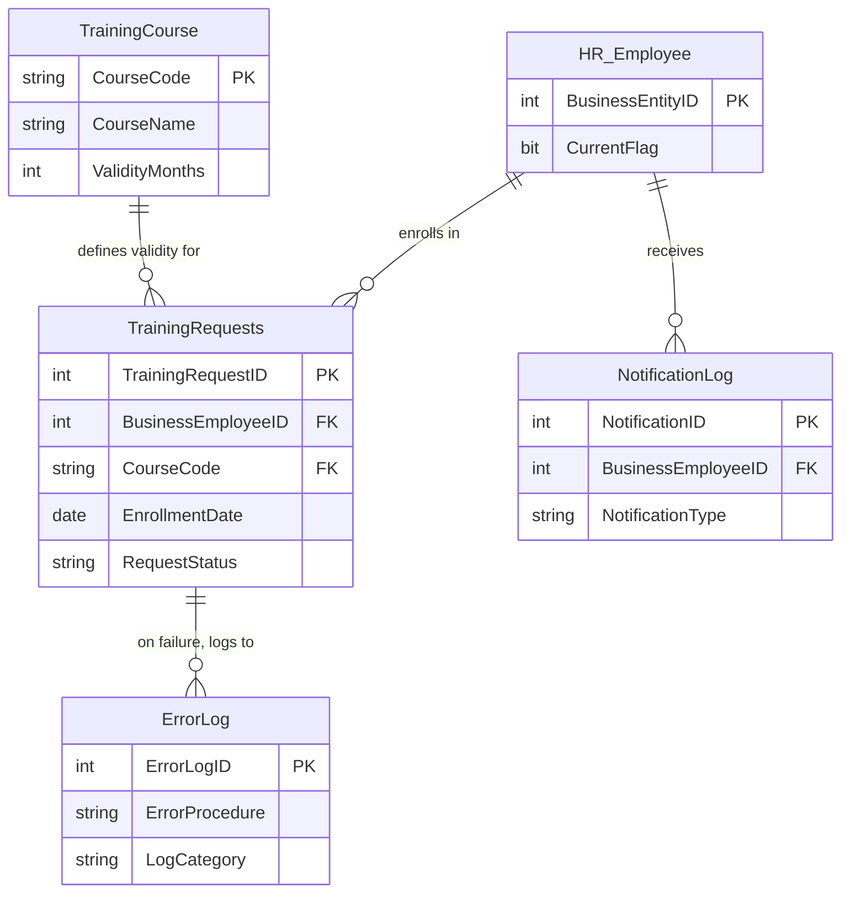
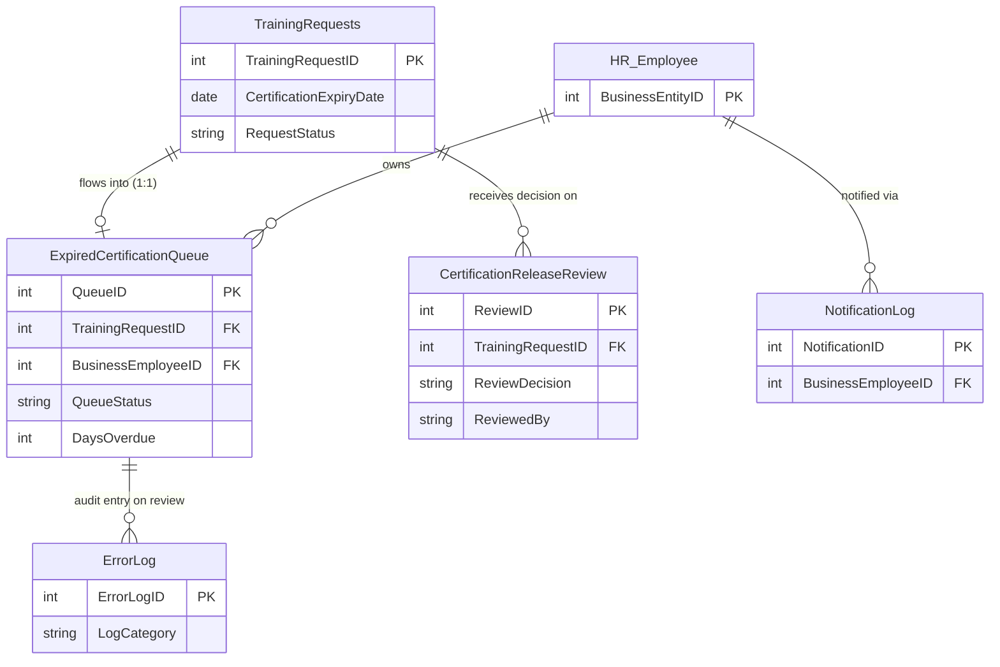
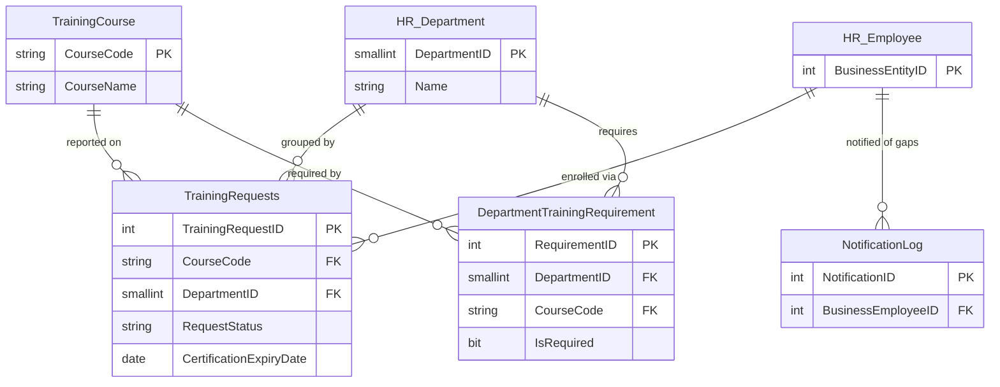

# HRTrainingOps — Project Overview Presentation

> **Employee Training & Certification Tracker**  
> SQL Server Database Development — Final Project  
> Platform: Microsoft SQL Server 2016 · T-SQL Only · AdventureWorks2022

---

## Project Overview


The system solves a real-world HR problem: **AdventureWorks has no way to manage employee training and certification lifecycles.** Employees enroll in courses, take exams, earn certifications that eventually expire — and right now, all of that is tracked manually with no centralized database, no automated expiry detection, and no controlled access.

**What our system does:**

- **Manages a training course catalog** — courses with validity periods, mandatory flags, and department-level requirements
- **Tracks employee enrollments end-to-end** — from enrollment → exam → score → certification → expiry, with full status lifecycle (Pending → Completed → Expired → Failed)
- **Automatically detects expired certifications** — a batch procedure scans for past-due expirations and queues them for manager review
- **Routes expired certs through a structured review workflow** — managers approve (Re-Enroll / Waive / Terminate) with full audit logging
- **Generates compliance reports with flexible filters** — dynamic SQL lets managers filter by department, course, or date range without hard-coded queries
- **Enforces role-based security** — 4 database roles (Admin, Manager, Clerk, Employee) with explicit GRANT, DENY, and row-level view filtering so each user sees only what they're authorized to see
- **Maintains a complete audit trail** — every status change, review decision, error, and notification is logged
- **Optimizes performance with strategic indexing** — clustered, nonclustered, and filtered indexes with execution plan evidence


---

## Team

| Name | Role | Key Contributions |
|------|------|-------------------|
| **Sahil Maniya** | Schema Designer | ERD, 7 normalized tables, 4 views, `final_script.sql` integration |
| **Parth Patel** | Logic Developer | 6 stored procedures, 2 UDFs, 3 triggers, transaction workflows |
| **Dhruv Patel** | Security & Optimization Lead | 4 roles, GRANT/DENY, 2 cursors, 5 indexes, performance analysis |

---

## Problem Statement

AdventureWorks HR has **no centralized system** to track:

- Which employees enrolled in which training courses
- Who passed, failed, or has an expired certification
- Which departments are missing mandatory training
- Who approved or rejected certification reviews

**Result:** Compliance risk, expired certifications going unnoticed, no audit trail, no access control on sensitive HR data.

---

## Our Solution: HRTrainingOps

A **T-SQL-only** database layer added to AdventureWorks2022 that:

| Capability | How |
|------------|-----|
| Tracks enrollments & exams | `TrainingRequests` table with status lifecycle |
| Detects expired certs | Batch procedure + expiry queue |
| Routes reviews to managers | Multi-step review workflow with audit trail |
| Restricts data by role | 4 database roles with GRANT / DENY |
| Reports compliance gaps | Dynamic SQL + department views |
| Optimizes queries | Strategic indexes with execution plan evidence |

**Zero GUI. Zero ORM. Pure T-SQL.**

---


## Three Business Workflows

> Each workflow below includes an ER diagram scoped to just the entities and relationships that workflow touches — for the complete normalized physical model, see `diagrams/hrtrainingops_erd.drawio`.

### Workflow 1 — Employee Enrollment

```
Training_Clerk → usp_EnrollEmployeeInCourse
  ↓
  Validate: active employee? course exists? no duplicate? no future date?
  ↓
  BEGIN TRANSACTION
    INSERT TrainingRequests (Pending)
    INSERT NotificationLog (Enrollment Confirmation)
  COMMIT
  ↓
  trg_TrainingRequests_ValidateEnrollment fires (re-validates dates/score)
  ↓
  On failure → ROLLBACK + ErrorLog entry
```

**Entities involved:**



**Demonstrates:** Stored procedure, transaction control, TRY/CATCH, AFTER trigger

**Achieves:** Replaces manual enrollment tracking with a single validated source of truth — no duplicate enrollments, no future-dated or invalid entries can slip in, and every enrollment leaves a notification + audit trail automatically, with zero manual follow-up.

### Workflow 2 — Expired Certification Review

```
usp_BatchUpdateExpiredCertifications
  ↓
  Marks expired → inserts into ExpiredCertificationQueue
  ↓
usp_ProcessExpiryQueueWithCursor (STATIC cursor)
  ↓
  Row-by-row: insert Notification, update queue → Notified
  ↓
HR_Manager → usp_ProcessCertificationReview
  ↓
  Decision: Re-Enroll | Waived | Terminated
  ↓
  BEGIN TRANSACTION
    Update queue → Resolved
    Insert CertificationReleaseReview
    Update TrainingRequests status
    Insert NotificationLog
    Insert ErrorLog (Audit)
  COMMIT
```

**Entities involved:**



**Demonstrates:** Batch procedure, static cursor, multi-table transaction, conditional logic

**Achieves:** Closes the exact compliance risk the proposal calls out — certifications that would otherwise expire unnoticed are automatically detected, queued, and routed to a manager decision (Re-Enroll / Waived / Terminated), with every decision permanently logged. Nothing expires silently anymore.

### Workflow 3 — Compliance Report (Dynamic SQL)

```
HR_Manager → usp_RunComplianceReport(@DeptName, @CourseCode, @FromDate, @ToDate)
  ↓
  Build @sql dynamically, execute with sp_executesql (parameterized — safe)
  ↓
usp_DynamicDepartmentNotification (DYNAMIC cursor)
  ↓
  Iterate departments with compliance gaps, generate notifications
  ↓
vw_ManagerDepartmentCompliance (row-level department filter)
```

**Entities involved:**



**Demonstrates:** Dynamic SQL, dynamic cursor, row-level view security

**Achieves:** Turns reactive HR follow-up into self-service reporting — managers get on-demand compliance visibility filtered by department, course, or date range without a developer writing a new report every time, and departments with missing required training get proactively flagged instead of discovered during an audit. Each manager sees only their own department's data.

---

## What the Three Workflows Achieve Together

| Business gap (from the proposal) | Closed by |
|---|---|
| No central training register | Workflow 1 — every enrollment lands in one validated table the moment it happens |
| Manual expiry tracking, certs lapse unnoticed | Workflow 2 — expiry detection, queueing, and manager sign-off are fully automated with an audit trail |
| No role-based access to sensitive HR data | Enforced across all three workflows via database roles, `DENY`, and row-level views — not bolted on afterward |
| No audit trail for reviews or errors | Workflow 2's review log + `ErrorLog`/`NotificationLog` populated by all three workflows |
| Slow, hard-coded compliance reporting | Workflow 3 — one parameterized procedure replaces what would otherwise be dozens of static reports |

Together, the three workflows take HR training compliance from "manual, reactive, unaudited" to "automated, proactive, fully logged" — end to end, in T-SQL only.

---

## Project Phases & Deliverables

| Phase | Lead | Status | Key Outputs |
|-------|------|--------|-------------|
| **I — Schema** | Sahil | Done | `schema/` (7 tables), ERD, proposal, constraints |
| **II — Logic & Security** | Parth | Done | `procedures/`, `functions/`, `views/`, `triggers/`, `security/` |
| **III — Optimization** | Dhruv | Done | `optimization/`, `test_data.sql`, `final_script.sql` |

---

## Repository & Files

```
SQL-SERVER-PROJECT/
├── schema/              7 CREATE TABLE scripts (Phase I)
├── functions/           fn_TrainingScoreClass, fn_GetEmployeeTrainingData
├── views/               4 views (summary, pending, compliance, self-service)
├── triggers/            3 AFTER triggers (validate, audit, queue transition)
├── procedures/          6 procs + 2 cursor procs
├── security/            permissions.sql + test_cases.sql
├── optimization/        indexes.sql + performance compare + analysis notes
├── diagrams/            ERD (draw.io + images)
├── Screenshot/          Sahil/ · Parth/ · Dhruv/
├── deploy_schema.sql    Phase I deploy
├── deploy_phase2.sql    Phase II deploy
├── test_data.sql        Sample data
├── final_script.sql     ★ Full deploy (Phase I + II + III)
└── README.md
```

**GitHub:** [github.com/sahilmaniya92/SQL-SERVER-PROJECT](https://github.com/sahilmaniya92/SQL-SERVER-PROJECT)

---


## Summary

| Metric | Count |
|--------|-------|
| Tables | **7** (3NF, full FK/CHECK) |
| Stored Procedures | **8** (incl. dynamic SQL + 2 cursor procs) |
| Functions | **2** (1 scalar + 1 TVF) |
| Views | **4** (incl. 2 row-level security) |
| Triggers | **3** (AFTER DML) |
| Cursors | **2** (1 static + 1 dynamic) |
| Database Roles | **4** (GRANT / DENY) |
| Indexes | **5** (clustered + NCI + filtered INCLUDE) |
| Transaction control | All DML procedures (TRY/CATCH) |
| Total `.sql` files | **34** |

---


### Tables — 7

> "We designed 7 interrelated tables in Third Normal Form. `TrainingCourse` is the catalog. `TrainingRequests` is the central fact table tracking every enrollment — it has foreign keys to Course, Employee, and Department, plus CHECK constraints on score range (0–100), status values, and date ordering. `ExpiredCertificationQueue` and `CertificationReleaseReview` handle the expiry-to-review lifecycle. `NotificationLog` and `ErrorLog` give us a full audit and messaging trail. Every table uses an IDENTITY primary key, DEFAULT values on dates, and explicit NOT NULL where business rules require it."

### Stored Procedures — 8

> "We have 6 core procedures plus 2 cursor-based procedures. `usp_EnrollEmployeeInCourse` is our main transactional workflow — it validates the employee is active, the course exists, no duplicate enrollment, and the date is not in the future, then wraps the insert inside BEGIN TRANSACTION with TRY/CATCH. `usp_RunComplianceReport` is our **dynamic SQL** procedure — it builds a SELECT statement at runtime based on optional filters for department, course, and date range, and executes it safely through `sp_executesql` with parameterized values — no string concatenation of user input. `usp_ProcessCertificationReview` is a multi-table transaction: it updates the queue status, inserts a review decision, updates the training request, sends a notification, and writes an audit log — all in one atomic transaction."

### Functions — 2

> "`fn_TrainingScoreClass` is a **scalar UDF** that takes a score and returns Pass (70+), Conditional (50–69), or Fail (below 50). We use it inside views and procedures so the classification logic is defined once. `fn_GetEmployeeTrainingData` is an **inline table-valued function** that returns all training rows for a given employee, joining Course, Person, Department, and calling the scalar function — it's used for the self-service and TVF demo."

### Views — 4

> "Two of our views are **abstraction views**: `vEmployeeTrainingSummary` joins 4 tables and adds a computed CertificationHealth column; `vw_PendingCertifications` filters only actionable rows. The other two are **row-level security views**: `vw_ManagerDepartmentCompliance` parses the login name to extract the department ID — so `HRTO_Mgr_7` only sees Department 7 data. `vw_EmployeeSelfService` does the same for employees — `HRTO_Emp_288` sees only their own rows. Admin and dbo see everything. This is enforced in the WHERE clause, not at the application layer."

### Triggers — 3

> "`trg_TrainingRequests_ValidateEnrollment` fires AFTER INSERT and UPDATE — it rejects future enrollment dates, scores outside 0–100, exam dates before enrollment, and duplicate active enrollments. This protects data integrity even if someone bypasses the stored procedure and inserts directly. `trg_TrainingRequests_AuditStatusChange` fires AFTER UPDATE on RequestStatus — it writes an audit row to ErrorLog so we have a full trail of who changed what status and when. `trg_ExpiredQueue_StatusTransition` enforces the queue must follow Pending Review → Notified → Resolved — you cannot jump from Pending Review straight to Resolved."

### Cursors — 2

> "We implemented one **static cursor** and one **dynamic cursor** as required. The static cursor in `usp_ProcessExpiryQueueWithCursor` takes a snapshot of all Pending Review queue items at OPEN time and processes each row — inserting a notification and updating the status to Notified. Static is appropriate here because we want a stable set while iterating. The dynamic cursor in `usp_DynamicDepartmentNotification` iterates departments with compliance gaps — DYNAMIC means it can see underlying data changes while the cursor is open. We also demonstrate the **set-based alternative** in `usp_BatchUpdateExpiredCertifications`, which processes all expired rows in one statement — this is preferred for performance in production."

### Database Roles — 4

> "We created 4 roles mirroring a real organization: `HR_Admin` has full control including ALTER ANY ROLE. `HR_Manager` can SELECT, run compliance reports, and approve reviews — but cannot delete data. `Training_Clerk` can enroll employees and update scores, but we use **DENY EXECUTE** on the review procedure and **DENY DELETE** on TrainingRequests — DENY overrides any future GRANT, which is more secure than simply not granting. `Employee_Client` can only SELECT from the self-service view — direct table access is blocked. We prove all of this with EXECUTE AS in our test script."

### Indexes — 5

> "The **clustered index** is on `TrainingRequestID` — a surrogate identity key with append-only inserts, so no page splits. The **nonclustered index** on `ExpiredCertificationQueue(BusinessEmployeeID, ExpiryDate)` with INCLUDE columns supports the expiry workflow lookups. The **filtered index** `IX_TrainingRequests_Pending` only indexes rows WHERE `RequestStatus = 'Pending'` with INCLUDE on CourseCode, EmployeeID, and DepartmentID — this is a covering index for the hot operational queries that clerks and managers run, and it's much smaller than indexing all historical rows. We prove the impact with `SET STATISTICS IO ON` and `SET SHOWPLAN_TEXT ON` — you can see the optimizer choosing Index Seek on the filtered index instead of a Clustered Index Scan."

### Transaction Control

> "Every DML procedure uses `BEGIN TRANSACTION` / `COMMIT` / `ROLLBACK` inside `TRY...CATCH`. If any step fails, CATCH rolls back the entire transaction and logs the error to ErrorLog before re-throwing. We set `XACT_ABORT ON` so even unexpected errors trigger automatic rollback. We demonstrate rollback live: the future-date enrollment test shows the insert is attempted, the trigger fires an error, CATCH catches it, ROLLBACK undoes the insert, and ErrorLog gets the entry — no orphan data."

### Total .sql Files — 34

> "Every database object lives in its own modular `.sql` file, organized into folders by type — schema, functions, views, triggers, procedures, security, optimization. This makes it easy to find, review, and maintain each component independently. `final_script.sql` ties them all together using SQLCMD `:r` includes so the entire system deploys from one script in dependency order."

---

**All code is authored by the group. Every member can explain every component.**

---

*HRTrainingOps — Sahil Maniya · Parth Patel · Dhruv Patel*
